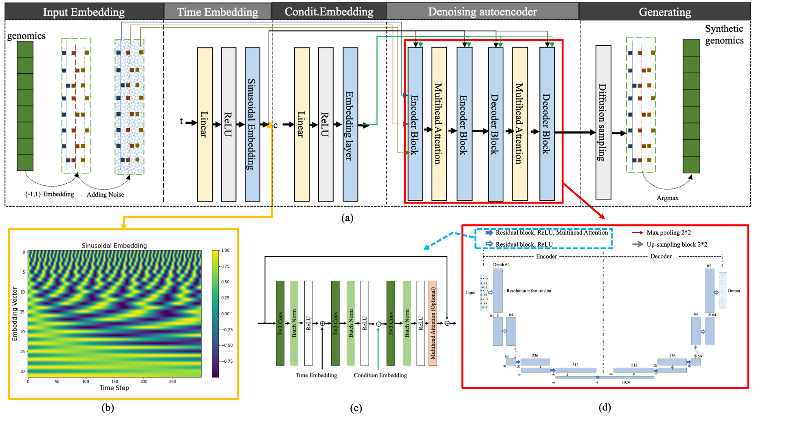

# GenoDiffusion
# GenoDiffusion: Conditional Denoising Diffusion Probabilistic Model for Genomic Data Augmentation
## This is an introduction to how to use GenoDiffusion to augment genomic data
**Introduction**
While a large amount of genomic sequences is quickly available thanks to recent bio-technological advances, there are still challenges in analyzing and sharing such data. Some major challenges include that genomic data is typically imbalanced or biased caused by disease rareness and test affordability, and it is hard to share genomic data due to concerns about privacy, security and consents.%recent advances in biotechnologies have made it possible to generate a large amount of genomic data quickly, genomic data is still limited by small sample size, imbalance, and bias caused by factors such as rare diseases, affordability of tests, and concerns about privacy and security.To address these challenges, we introduce a novel conditional denoising diffusion probabilistic based method, called GenoDiffusion, to enhance genomic data by generating realistic synthetic data which is balanced and free to share. GenoDiffusion achieves this by utilizing conditional denoising diffusion models, which are a type of generative models that learn the underlying distribution capture complex dependencies between features in input data. By leveraging the original genomic data as input, our proposed GenoDiffusion can generate new data with similar population structures, variant frequency distributions, and linkage disequilibrium patterns.  Experimental results demonstrate that GenoDiffusion outperforms existing methods on multiple genomic datasets including genotypes on the human leukocyte antigen region and prostate cancer.

**Figure 1** Structure of the proposed GenoDiffusion model: (a)the architecture of GenoDiffusion for generating synthetic genomics; (b)A sinusoidal embedding. Each time step from 0 to T is assigned a unique representation from the sinusoid function; (c) A ResNet Block with time embedding, condition embedding and multi-head attention; condition embedding and time embedding (i.e., sinusoidal embedding) are employed with a classifier-free guidance method.  (d)A U-Net autoencoder, where denosing autoencoder maps the input into resolution of 4, multi-head attentions are employed in resolution level less than 16 to capture the relationship among features.
